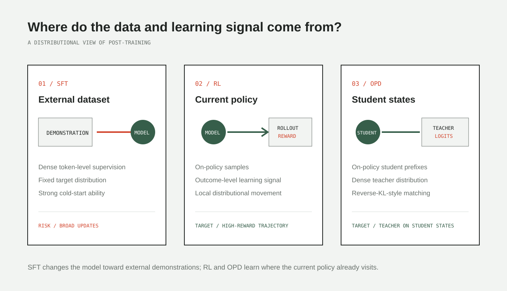

*整理自 wh 的原文，建议对照阅读。*

这篇文章把语言模型看成序列上的概率分布，把后训练看成对分布形状的修改。这个视角并不严格，但用来理解 SFT、RL 和 On-Policy Distillation（OPD）的差别很直观：它们使用不同来源的数据，也把概率质量推向不同的地方。

## SFT 被外部数据拉向一个固定目标

SFT 的目标在训练开始前就被数据集确定了。样本无论来自人工标注还是更强的模型，交叉熵做的事情都一样：提高示范 token 的概率。

问题在于，损失函数不区分某个 token 是解题的关键步骤，还是数据里的表达习惯。“therefore” 和一个数学运算符得到的是同一种监督。目标数据如果离原模型的分布很远，这种密集更新就容易波及原本已经学会的能力。

这并不妨碍 SFT 成为最有效的冷启动方法。需要快速改变输出格式、建立指令遵循时，直接模仿数据正是它的优势。

## RL 只在当前策略走过的地方更新

在线 RL 的训练数据来自模型自己。当前策略先生成一批回答，奖励函数给出分数，随后提高高奖励轨迹的概率。它不会像 SFT 那样被一个外部数据分布整体拉走，而是主要修改模型本来就会访问的区域。

这里的前提是奖励值得相信。数学和代码任务可以使用可验证结果，奖励方向通常比较可靠；换成奖励模型或 LLM judge，优化的就可能只是一个有偏的质量代理。

## OPD 更像带教师的 RL

OPD 使用教师分布提供监督，但数据不是教师预先生成的，而是由学生当前策略采样。教师在学生实际走到的前缀上给出 logits，学生再去匹配教师分布。

它和 RL 的结构很像，只是把 advantage 换成了师生概率的比值。相比只给整条回答一个结果奖励，教师能在每个 token 上提供更密集的信号；代价是这些信号不一定和任务重要性一致。

原文提到 OPSD 的 token 级分析：`wait`、`alright` 一类风格词的 KL 可能高于 `power`、`exponent` 等数学词。模型如果只追着 KL 最大的地方更新，很容易把精力花在风格差异上。这也是 OPD 往往需要 token 级裁剪的原因。

## 教师模型的差距没有传给学生

作者用的是一个最小代码编辑任务：给模型一段存在 bug 的函数，只允许修复 bug，其他部分尽量不动。训练和测试使用不同类型的代码破坏，因此既能观察模型有没有学会“最小修改”这个一般行为，也能用 LiveCodeBench 检查通用代码能力是否被遗忘。

实验先得到一个 SFT 教师和一个 RL 教师，再分别用它们训练 OPD 学生：

| 模型 | Pass@1 ↑ | Norm. Levenshtein ↓ | Added CC ↓ | LiveCodeBench v6 ↑ |
| --- | ---: | ---: | ---: | ---: |
| SFT teacher | 0.775 | 0.450 | 0.450 | 0.286 |
| RL teacher | 0.792 | 0.063 | 0.206 | 0.320 |
| OPD · SFT teacher | **0.800** | 0.059 | **0.206** | 0.297 |
| OPD · RL teacher | 0.787 | **0.055** | 0.228 | **0.314** |

`Pass@1` 衡量修复是否正确；`Norm. Levenshtein` 和 `Added CC` 越低，说明模型越能克制不必要的改写；LiveCodeBench 用来观察通用代码能力。

SFT 和 RL 教师都学会了修复任务，但行为明显不同。SFT 教师会大幅改写代码，归一化编辑距离达到 0.450，LiveCodeBench 也从基线能力上出现了更明显的下降。RL 教师的编辑距离只有 0.063，通用代码表现也更好。

按直觉，RL 教师更强，蒸馏出的学生也应该明显更强。实际并非如此。两个 OPD 学生的结果非常接近：SFT 教师对应的学生甚至拿到了最高的 Pass@1，而 RL 教师对应的学生在编辑距离和 LiveCodeBench 上略好。

更值得注意的是，SFT 教师的通用代码能力已经退化，但它的 OPD 学生没有完整继承这种退化。学生的 LiveCodeBench 从教师的 0.286 回到 0.297，编辑距离则从 0.450 降到 0.059。

这里真正起作用的不只是教师给了什么答案，还有学生在哪里向教师提问。OPD 学生只在自己会访问的前缀上接收监督，不需要复制教师的全部行为分布。一个通过大量 SFT 得到的专项模型，仍然可能作为能力教师，再通过 OPD 把能力迁移给更接近原始分布的学生。

## On-policy data 可能才是关键

常见解释是 SFT 在最小化 forward KL，而 RL 更接近 reverse KL。Forward KL 有 mode-covering 倾向，会要求模型覆盖外部数据中的各类模式；reverse KL 更倾向停留在当前模型已经具有较高概率的模式附近。这个解释有用，但不完全够，因为 RL 即使弱化或移除显式 KL penalty，仍然经常比 SFT 更少遗忘。

我更认同原文关于 on-policy data 的解释。考虑最简单的 0/1 奖励：成功样本产生正向信号，失败样本不更新，此时奖励就像一次 rejection sampling。因为样本来自当前策略，训练会倾向于找到离当前模型最近的可行策略，而不是跳向任意一个能完成任务的分布。

OPD 也是如此。教师决定更新方向，学生的采样分布限制更新发生的位置。这个限制本身就像一种隐式的 KL regularization，也解释了为什么使用已经退化的 SFT 教师，学生仍然可能保留更多原有能力。

这个解释也能对应到参数更新的观察。原文引用的研究发现，SFT 的更新更密集、冗余更多；RL 更像是在一个较小的子网络上产生稀疏但重要的更新。SFT 会对示范中的每个 token 施加压力，RL 则只通过当前策略采样到的行为传递信号。

## 为什么 OPD 学生可能超过教师

OPD 不是把教师生成的答案重新做一遍监督微调。训练状态来自学生，教师是在学生自己的错误路径上提供下一步分布。学生和教师会犯不同的错误，因此这种监督比只学习教师轨迹更有针对性。

另外，匹配教师 logits 也不等于复制教师的 greedy output。完整分布里还包含教师对不同续写的相对偏好、不确定性和推理分支。学生的采样行为可能因此得到改善，即使教师自己采样出的答案并没有更好。

但密集信号也有代价。OPD 的熵下降可能比 RL 更突然，容易出现 mode collapse。原文提到，一些高温自蒸馏实验即使使用质量很差的生成数据也能提高代码指标，这说明模型学到的可能不只是数据表面的正确性，而是整个输出分布被重新塑形后的结果。这部分目前仍然更接近观察，而不是一个完整解释。

## 放回后训练流程里

SFT、RL 和 OPD 解决的并不是同一个阶段的问题。SFT 适合建立格式和基本指令遵循；奖励可靠的数学、代码任务适合继续做 RL；OPD 则适合把专项模型的能力合并回最终模型。

文章最后留下的问题也很实际：RL 的结果奖励偏差低，但信号太稀疏；蒸馏能提供每个 token 的密集信号，却会带入教师偏差。更好的方法需要保留 on-policy 训练，同时在信号密度和 credit assignment 之间找到更好的平衡。
